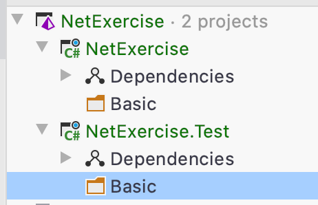

# Các bước để làm bài

## I. Setup

1. Tạo một repository tên là NetExercise trên github rồi clone về máy
2. Tạo một empty solution có tên là NetExercise sao cho file NetExercise.sln nằm trong thư mục gốc
3. Thêm vào solution một project có kiểu là Library, ngôn ngữ C#, sử dụng DotnetCore tên là NetExercise

Thao tác 2, 3 có thể gộp lại nhưng chú ý project phải đúng yêu cầu như trên


4. Tạo Test Project có tên là NetExercise.Test, ngôn ngữ C# và Type là NUnit


5. Tạo liên kết từ Project NetExercise đến project NetExercise.Test bằng cách từ project NetExercise.Test chọn Add References


Sau đó chọn dự án NetExercise và Add


6. Xóa class mặc định

Trong 2 projects đã tạo, ta thấy 2 class mặc định là Class1.cs và UnitTest1.cs, xóa cả 2 đi.


7. Build cả 2 project


8. Thêm file này [.gitignore](.gitignore) vào thư mục gốc

9. Push code lên repository

## II. Tích hợp CircleCI

1. Đăng nhập vào CircleCI, setup dự án và làm theo các steps (đừng chọn cái gì mang tính tự động)
2. Thêm vào mã nguồn [file này](https://github.com/voquanghoa/NetCoreCLI/blob/master/.circleci/config.yml) (chú ý đúng đường dẫn tương ứng)
3. Tham khảo file ReadMe.md ở [đây](https://raw.githubusercontent.com/voquanghoa/NetCoreCLI/master/Readme.md) và add vào dự án
4. Push code lên
5. Verify mã nguồn đã được build Success trên CircleCI

## III. Implement bài mới

1. Đảm bảo mình đang ở nhánh master và đang được mới nhất

```
git checkout master
git pull
```

Lệnh `git checkout` dùng để chuyển sang 1 nhánh có sẵn, `git pull` là cập nhật từ remote (ở đây là github) và local

2. Tạo nhánh mới tương ứng với bài chuẩn bị làm và checkout vào nhánh đó, ví dụ

```
git checkout -b add-basic-exercise-01
```

Lệnh `git chekout` với tham số `-b` là tạo ra nhánh mới và checkout vào nhánh mới đó

3. Nếu bắt đầu làm một phần mới, hãy tạo thư mục tương ứng để lưu trữ code, ví dụ ở đây là Basic



4. Tạo file class với mã nguồn tương ứng để giải


5. Chạy UnitTest bằng cách right click lên class test (Ở đây là Exercise01Test) và chọn Run Unit Test
   

6. Đảm bảo tất cả các test case đều pass


7. Đưa phần đã làm lên remote (Các thao tác này nên dùng source tree để thực hiện)

```
git add *
git commit -m "Add basic exercise 01"
git push
```

Chú ý:

- Thao tác `git add *` là xác nhận tất cả các sửa đổi ở tất cả các file. Nên dùng source tree để xem danh sách sửa đổi để tránh thêm nhầm
- Trước khi chạy `git add *`, có thể sử dụng `git status` để xem trước thay đổi

8. Tạo pull request từ nhánh đã chọn sang master

## IV. Cập nhật bài đã làm

1. Hoàn tất công việc hiện tại bằng cách add/commit/push hoặc dùng lệnh stash (đọc kỹ trên google trước khi dùng)

2. Chuyển sang nhánh của bài cần cập nhật bằng thao tác

```
git checkout add-basic-exercise-01
```

Không có tham số `-b` vì mình không tạo ra nhánh mới

3. Sửa chữa bài làm theo comment, sau đó đấy lên github add/commit/push

4. Reply comment `Done` hoặc trả lời rõ ràng, đặt câu hỏi
